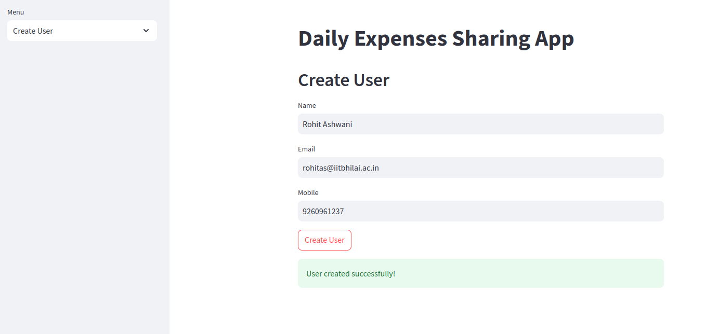
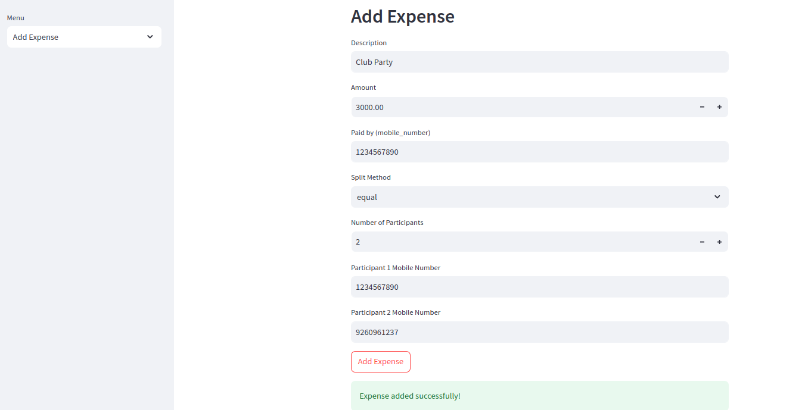
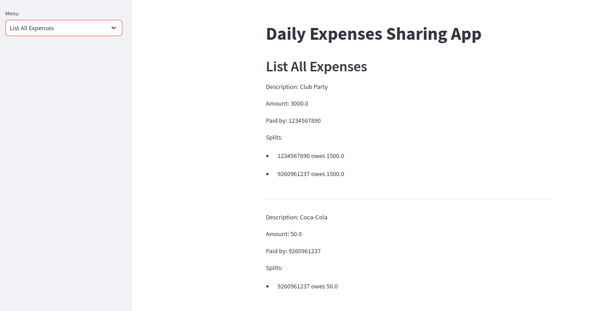
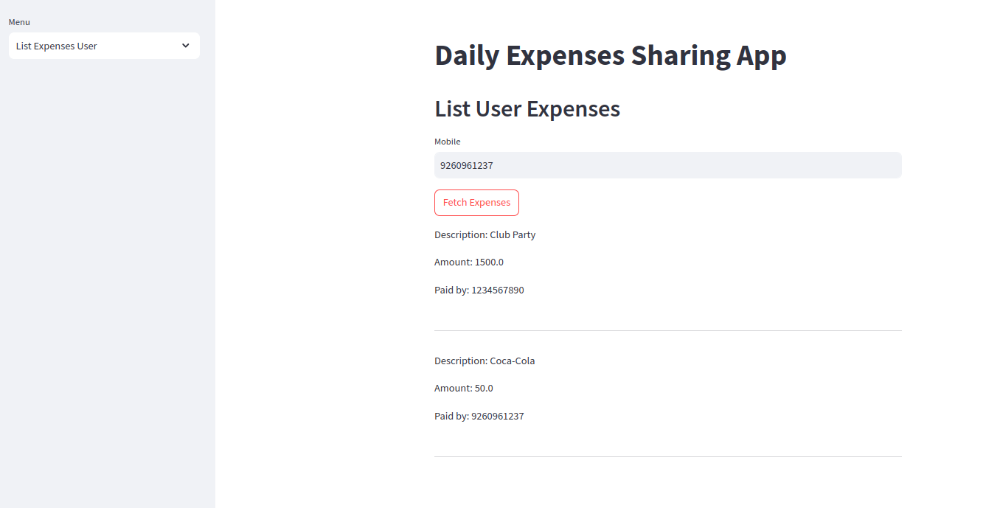
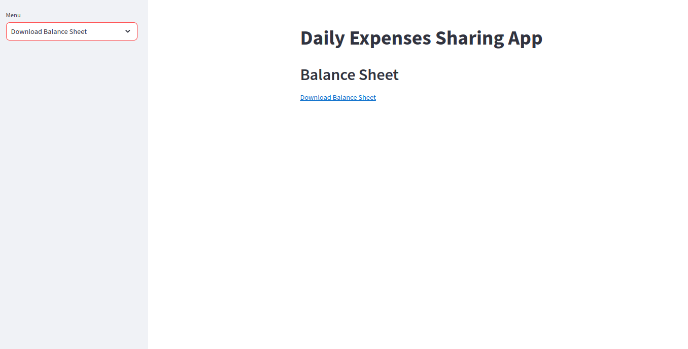
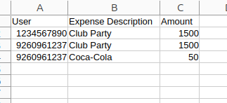

# Daily Expense Tracker Application

This is a simple expense tracker application built with FastAPI, MongoDB, and Streamlit. It allows users to track expenses and download a balance sheet.


# Setup Instructions
1. Clone the Repository
```
git clone https://github.com/rohitashwani1/Daily_Expense_Sharing_Application.git
cd Daily_Expense_Sharing_Application
```

2. Create a Virtual Environment
```
python -m venv myenv
source myenv/bin/activate
```
3. Install Dependencies
```
pip install -r requirements.txt
```

4. Configure MongoDB

    **Fill in the connection_url of Mongodb in app/database/connection.py**


5. Run the FastAPI Application
```
uvicorn app.main:app --reload
```
The FastAPI application will be available at http://127.0.0.1:8000.

6. Run the Streamlit Application
```
streamlit run app/streamlit_app.py
```
The Streamlit application will be available at http://localhost:8501


# Interface







**Screenshot of Balance sheet**


